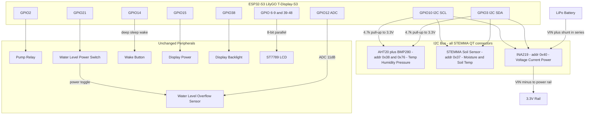

# Hardware V2 — Sensor Upgrade Plan

## Motivation

The v1 hardware has three key data quality problems identified through real HA data analysis:

1. **DHT11** — integer-only precision (±2°C, ±5% RH), bit-bang protocol, frequent CRC failures
2. **Capacitive soil moisture sensor** — no temperature compensation; the daily room temperature cycle (±3°C) produces a ±35 ADC count artifact that looks like watering events but is pure noise (~0.8% per °C)
3. **Battery ADC** — ×2 voltage divider + noisy ADC gives ±60 mV jitter per reading

The **water level sensor** is intentionally kept as a binary overflow detector (prevents pump trigger when tank is full). No change needed there.

---

## Bill of Materials

All three are genuine **Adafruit** products — not AliExpress clones. Quality is significantly better than generic modules.

| # | Part | Product | Purpose | Replaces | Price |
|---|------|---------|---------|----------|-------|
| 1 | **AHT20 + BMP280** combo module | AliExpress item 1005010703384457 | Air temp (±0.3°C) + humidity (±2% RH) + pressure (±1 hPa) | DHT11 | ~CHF 2.37 |
| 2 | **Adafruit STEMMA Soil Sensor** | AliExpress item 1005012129914388 | Capacitive soil moisture (200–2000) + soil temp | Capacitive ADC sensor | ~CHF 5.99 |
| 3 | **INA219** power monitor | AliExpress item 1005012177858055 | Battery voltage + current draw + power consumption | ADC voltage divider | ~CHF 4.59 |

**Total: ~CHF 12.95**

All three sensors share a single **I2C bus** — only 2 wires (SDA + SCL) for all upgrades. All have STEMMA QT / Qwiic connectors (solderless).

---

## I2C Addresses

| Sensor | Address | Configurable? |
|--------|---------|---------------|
| AHT20 | `0x38` | No |
| BMP280 | `0x76` or `0x77` (SDO pin) | Yes, 1 bit |
| STEMMA Soil | `0x36` | Yes, via firmware command |
| INA219 | `0x40` | Yes, via A0/A1 pins (0x40–0x4F) |

✅ No address conflicts.

---

## Rust Crate Support (no-std)

| Sensor | Crate | no-std | async | Maintained |
|--------|-------|--------|-------|------------|
| AHT20 | [`embedded-aht20`](https://crates.io/crates/embedded-aht20) | ✅ | ✅ (feature flag) | ✅ Feb 2025 |
| BMP280 | [`bme280-rs`](https://crates.io/crates/bme280-rs) | ✅ | ✅ embedded-hal-async | ✅ 2024–25 |
| STEMMA Soil | [`stemma-soil-sensor-embassy`](https://crates.io/crates/stemma-soil-sensor-embassy) | ✅ | ✅ Embassy | ✅ 2024–25 |
| INA219 | [`ina219`](https://crates.io/crates/ina219) | ✅ | ✅ (feature flag) | ✅ Feb 2026 |

**STEMMA Soil note**: The `stemma-soil-sensor-embassy` crate is Embassy-specific — perfect for this project since it already uses Embassy.

---

## Sensor Improvements

### Air Temperature & Humidity: DHT11 → AHT20 + BMP280

| Metric | DHT11 (v1) | AHT20+BMP280 (v2) |
|--------|-----------|------------------|
| Temp accuracy | ±2°C | ±0.3°C |
| Humidity accuracy | ±5% RH | ±2% RH |
| Precision | Integer (1°C steps) | Float (0.01°C) |
| Protocol | Bit-bang 1-wire | I2C |
| Reliability | ~80% (CRC failures) | >99.9% |
| Bonus | — | Barometric pressure (±1 hPa) |

### Soil Moisture: Capacitive ADC → Adafruit STEMMA Soil

| Metric | Capacitive v1 | STEMMA Soil (v2) |
|--------|--------------|-----------------|
| Output | Raw ADC counts (800–2150) | Capacitive counts (200–2000) |
| Temperature compensation | ❌ None | ✅ Soil temp included |
| Daily temp artifact | ±35 counts (~2.5%) | Reduced (compensatable) |
| Protocol | ADC | I2C |
| Exposed metal | Yes (oxidises over time) | No (fully sealed probe) |

> **Note**: The STEMMA sensor still uses a bare ATSAMD10 MCU internally — it gives raw capacitive counts (200–2000), not a calibrated % directly. However the range is well-documented and consistent, and the separate soil temperature reading allows software compensation.

### Battery: ADC voltage divider → INA219

| Metric | ADC ×2 (v1) | INA219 (v2) |
|--------|------------|------------|
| Voltage noise | ±60 mV | ±4 mV (12-bit, 0–26V range) |
| Current measurement | ❌ None | ✅ ±3.2A bidirectional, ±0.8 mA resolution |
| Power measurement | ❌ None | ✅ Calculated from V×I |
| Under-load sag | Reads low during WiFi TX | Measures the actual sag — it's a feature |
| Protocol | ADC | I2C |
| Crate | Built-in ADC | [`ina219`](https://crates.io/crates/ina219) v0.2.1, async ✅ |
| Shunt resistor | External voltage divider | Built-in R100 (0.1Ω) on module |

> **Why INA219 beats MAX17048 here**: MAX17048 only tells you voltage and estimated %. The INA219 tells you *actual current draw* — you'll see exactly how many mA the ESP32 pulls during WiFi, how much the pump draws, and whether your battery is being drained faster than expected. The voltage measurement is also far cleaner since it measures directly without a noisy voltage divider.

> **Wiring note**: The INA219 must be placed **in series** with the battery positive lead — current flows through the built-in 0.1Ω shunt resistor. The module has two screw terminals (VIN+ and VIN−) for this. The I2C connector then goes to the ESP32 as usual.

---

## GPIO Pin Assignment (V2)

### Freed pins
| GPIO | Was | Status |
|------|-----|--------|
| 1 | DHT11 data | ✅ Free |
| 4 | Battery ADC | ✅ Free |
| 11 | Moisture ADC | ✅ Free |
| 16 | Moisture power | ✅ Free |

### New I2C bus
| GPIO | Function | Notes |
|------|----------|-------|
| **3** | I2C SDA | Currently unused — verify not a strapping pin |
| **10** | I2C SCL | Currently unused — verify not a strapping pin |

### Unchanged pins
| GPIO | Function |
|------|----------|
| 2 | Pump relay |
| 12 | Water level ADC (overflow detection — kept) |
| 14 | Wake button |
| 15 | Display power |
| 21 | Water level power |
| 38 | Display backlight |
| 5–9, 39–48 | ST7789 display |

---

## Wiring Diagram (V2)

> Add a **4.7kΩ pull-up resistor on SDA and SCL to 3.3V** — one shared pair for all sensors on the bus. The Adafruit breakouts may include these already; check before adding extras.

---

## Firmware Changes Required

1. **Remove** `dht11.rs` entirely
2. **Remove** ADC pin setup for GPIO4 (battery) and GPIO11 (moisture) from `sensors/hardware.rs` and `sensors/builder.rs`
3. **Add** I2C bus init on GPIO3/GPIO10 at 400 kHz in `sensors/hardware.rs`
4. **Add** AHT20 driver (`embedded-aht20` crate) → publish temp (f32), humidity (f32)
5. **Add** BMP280 driver (`bme280-rs` crate) → publish pressure (f32, optional)
6. **Add** STEMMA soil driver (`stemma-soil-sensor-embassy` crate) → publish moisture counts + soil temp; remap address to `0x37`
7. **Add** INA219 driver (`ina219` crate v0.2.1, async feature) → publish voltage (mV), current (mA), power (mW); wire battery positive lead through INA219 shunt terminals
8. **Update** `domain.rs` — `MoistureLevel` thresholds mapped to STEMMA 200–2000 range
9. **Update** MQTT discovery payloads in `update_task.rs` — new sensors: current (`mA`), power (`mW`); updated units for all
10. **Keep** water level ADC path unchanged (GPIO12 + GPIO21)
11. No I2C address conflicts — INA219 at `0x40` is clear of all other sensors
