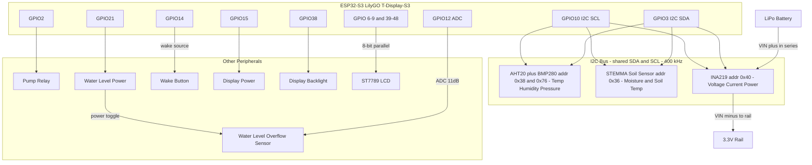

# ESP32 Plant Watering System

A microcontroller-based system for automated plant watering with ESP32. Monitor soil moisture and control the watering pump.

Built for [LilyGO T-Display-S3](https://github.com/Xinyuan-LilyGO/T-Display-S3) ESP32-S3 development board


**Board Features:**

- ESP32-S3 dual-core MCU
- 1.9" LCD Display (170x320)
- USB-C connector
- Built-in battery management

## Wiring — V2 Hardware

> See [HARDWARE_V2.md](HARDWARE_V2.md) for full BOM, crate analysis, and migration notes from V1.



## Core Features

- **Sensor Integration (V2)**

  - AHT20: air temperature (±0.3 °C) + humidity (±2 %RH) over I2C
  - BMP280: barometric pressure (±1 hPa) over I2C
  - STEMMA Soil: capacitive soil moisture counts (200–2000) + soil temperature over I2C
  - INA219: battery voltage, current draw, and power consumption over I2C
  - Water level overflow detection (ADC binary threshold — unchanged from V1)

- **Display Interface**

  - ST7789 LCD support
  - Real-time sensor data visualization
  - System status display

- **Network Connectivity**

  - WiFi connection with DHCP
  - MQTT integration with Home Assistant auto-discovery
  - Sensor state published each wake cycle
  - Pump controlled via HA switch entity; retained `ON` survives deep sleep and executes on next wake

- **Power Management**
  - Deep sleep support
  - Configurable wake/sleep cycles
  - Battery-optimized operation

## MQTT Integration

### Published topics

| Topic | Values | Description |
|-------|--------|-------------|
| `{DEVICE_ID}/temperature` | `{"value": "22"}` | Air temperature (°C) |
| `{DEVICE_ID}/humidity` | `{"value": "55"}` | Air humidity (%) |
| `{DEVICE_ID}/moisture` | `{"value": "Dry"}` | Soil moisture level |
| `{DEVICE_ID}/moistureraw` | `{"value": "1850"}` | Raw soil moisture (mV) |
| `{DEVICE_ID}/overflow` | `{"value": "YES"}` / `{"value": "NO"}` | Drainage overflow sensor |
| `{DEVICE_ID}/batteryvoltage` | `{"value": "3820"}` | Battery voltage (mV) |

### Subscribed topics

| Topic | Payload | Description |
|-------|---------|-------------|
| `{DEVICE_ID}/pump/set` | `ON` / `OFF` | Schedule pump run (retained); device resets to `OFF` after acting |

### Pump control

The pump is controlled exclusively via Home Assistant using a **switch entity**. The switch state is retained by the MQTT broker, so it survives the device's deep sleep (~59.5 min per cycle).

**Flow:**
1. Flip the **Water pump** switch to `ON` in HA from anywhere — broker stores it as retained.
2. On the next wake cycle, the device reads all sensors first (establishing overflow state).
3. Device then subscribes to the pump topic — retained `ON` is delivered with overflow state already known.
4. Device resets the switch to `OFF` (retained) so a second wake doesn't re-trigger.
5. If overflow detected (raw ADC > 2800; measured ~2217 mV dry, ~3475 mV submerged) — blocked, pump does not run.
6. Otherwise runs the pump for **10 seconds**.

There is no auto-trigger from soil moisture. The pump run is awaited inline by the wake cycle: commands arriving during a run are processed only after it completes, and the device never enters deep sleep mid-run.

---

## Dependencies

The project uses several Rust crates to provide functionality:

### Async/Embedded Frameworks

- [embassy](https://crates.io/crates/embassy)
- [embassy-executor](https://crates.io/crates/embassy-executor)
- [embassy-futures](https://crates.io/crates/embassy-futures)
- [embassy-net](https://crates.io/crates/embassy-net)
- [embassy-sync](https://crates.io/crates/embassy-sync)
- [embassy-time](https://crates.io/crates/embassy-time)

---

### Hardware Abstraction & Embedded I/O

- [embedded-hal](https://crates.io/crates/embedded-hal)
- [embedded-text](https://crates.io/crates/embedded-text)
- [embedded-graphics](https://crates.io/crates/embedded-graphics)

---

### Networking

- [rust-mqtt](https://crates.io/crates/rust-mqtt)
- [esp-wifi](https://crates.io/crates/esp-wifi)

---

### ESP32-Specific Crates

- [esp-alloc](https://crates.io/crates/esp-alloc)
- [esp-backtrace](https://crates.io/crates/esp-backtrace)
- [esp-hal](https://crates.io/crates/esp-hal)
- [esp-hal-embassy](https://crates.io/crates/esp-hal-embassy)

---

### Display

The built-in 1.9" ST7789 LCD display on the T-Display-S3 has the following pin configuration:

- Backlight: GPIO38
- CS: GPIO6
- DC: GPIO7
- RST: GPIO5
- WR: GPIO8
- RD: GPIO9
- Data pins: GPIO39-42, GPIO45-48

- [mipidsi](https://crates.io/crates/mipidsi)

---

### Serialization

- [serde](https://crates.io/crates/serde)
- [serde_json](https://crates.io/crates/serde_json)

---

### Miscellaneous

- [heapless](https://crates.io/crates/heapless)
- [static_cell](https://crates.io/crates/static_cell)
- [rand_core](https://crates.io/crates/rand_core)
- ...and others

---

## Setup

### 1. Clone the repository

```sh
git clone https://github.com/yourusername/esp32-homecontrol-no-std-rs.git
cd esp32-homecontrol-no-std-rs
```

---

### 2. Install Rust and the necessary tools

See the [ESP-RS book](https://docs.esp-rs.org/book/introduction.html).

Install espup: [espup GitHub](https://github.com/esp-rs/espup)

```sh
espup install
. $HOME/export-esp.sh
```

---

### 3. Build and run the project

```sh
cp .env.dist .env
./run.sh
```

---

## Development Tools

### Validate Agent Skills

To validate the `.claude/skills` directory structure:

```sh
# Install skills-ref validator (one-time)
cd /tmp
git clone https://github.com/agentskills/agentskills.git
cd agentskills/skills-ref
pipx install .

# Validate the skill
skills-ref validate .claude/skills/esp32-rust-embedded
```

---

## Usage

To flash the firmware to your ESP32 device, run:

```sh
cargo run --release
```

---

## Useful Links

### DHCP & Wi-Fi

- [DHCP Wi-Fi Example with Embassy](https://github.com/esp-rs/esp-hal/blob/main/examples/src/bin/wifi_embassy_dhcp.rs)

### MQTT Communication

- [MQTT Example](https://github.com/etiennetremel/esp32-home-sensor/blob/fff5f7ca4055e38ed5c296d0544fa8e61d855388/src/main.rs)

### Display Interfaces

- [MIDISPI Example with Display](https://github.com/embassy-rs/embassy/blob/227e073fca97bcbcec42d9705e0a8ef19fc433b5/examples/rp/src/bin/spi_gc9a01.rs#L6)
- [Display Example via SPI](https://github.com/embassy-rs/embassy/blob/227e073fca97bcbcec42d9705e0a8ef19fc433b5/examples/rp/src/bin/spi_display.rs#L6)

### Sensors

- [embedded-aht20 crate](https://crates.io/crates/embedded-aht20) — AHT20 async driver
- [bme280-rs crate](https://crates.io/crates/bme280-rs) — BMP280/BME280 async driver
- [ina219 crate](https://crates.io/crates/ina219) — INA219 async power monitor driver
- [stemma_soil_moisture_sensor crate](https://crates.io/crates/stemma_soil_moisture_sensor) — STEMMA Soil Sensor driver
- [Moisture Sensor Example](https://github.com/nand-nor/plant-minder/blob/4bc70142a9ec11e860b5422deb9d85ad192bab66/pmindp-esp32-thread/src/sensor/probe_circuit.rs#L63)

### UI & Graphics

- [Icons and UI Example with Display & Publish](https://github.com/sambenko/esp32s3box-display-and-publish)

### Projects and Games

- [Pacman Game Example](https://github.com/georgik/esp32-spooky-maze-game)
- [Motion Sensors & Body Tracking Example](https://github.com/SlimeVR/SlimeVR-Rust/blob/9eff429f4f01c8b7c607f3c3988de82729c753b3/firmware/src/peripherals/esp32/esp32c3.rs#L38)

### Networking

- [Netstack & MQTT Struct Example](https://github.com/mirkomartn/esp32c3-embassy-poc/blob/9ad954dcba19897a973e3453fd83196829eee485/src/netstack.rs)
- [HTTP Request Example with Embassy](https://github.com/embassy-rs/embassy/blob/86578acaa4d4dbed06ed4fcecec25884f6883e82/examples/rp/src/bin/wifi_webrequest.rs#L136)
- [NTP Socket Example](https://github.com/vpetrigo/sntpc/blob/2711f17d42b9a681ced02639780fe72cd8042b36/examples/smoltcp-request/src/main.rs)

### Miscellaneous Examples

- [Joystick Analog Pin Input Example](https://github.com/WJKPK/rc-car/blob/f1ce37658c7b8b6cbc47c844243ea8b90d1e1483/pilot/src/main.rs)
- [Battery Monitoring Example](https://github.com/longxiangam/work_timer/blob/788c0bee18ec47adce07e3ba71e884920e6473e1/src/battery.rs)

### Tutorials

- [ESP32 Rust HAL Tutorials](https://blog.theembeddedrustacean.com/series/esp32c3-embedded-rust-hal)

### Advanced Examples

- [Futures Example](https://github.com/kamo104/esp32-rust-mqtt-esp-now-gateway/blob/main/src/main.rs)
- [Sleep, Display Layout, Logging, Dashboard, Multiple Tasks](https://github.com/claudiomattera/esp32c3-embassy/blob/master/esp32c3-embassy/src/sleep.rs)

### Bitcoin Device, USB, & OTA Updates

- [Fancy Bitcoin Device with GUI Example](https://github.com/frostsnap/frostsnap/blob/0b2d589bcf8a0863e1067595aae8c9376cfb4867/device/src/graphics/animation.rs)

---

This documentation is curated to help you get started with various functionalities, libraries, and examples for ESP32 projects using Rust.